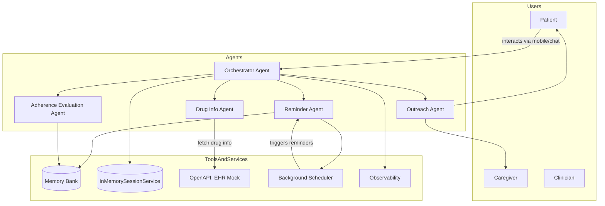

````markdown
# 🏥 MedAssist — Smart Medication Adherence Agent


**MedAssist** is a privacy-first, multi-agent system designed to help patients adhere to medication schedules.  
It detects missed doses, provides empathetic medical education, and logs adherence data using Google’s Agent Development Kit (ADK) and Gemini 1.5.

---

## 💡 The Problem
Medication non-adherence is a global health crisis, leading to worsening conditions and increased hospitalizations.  
Patients often forget doses, misunderstand side effects, or lack immediate guidance when they make a mistake (e.g., double dosing).

---

## 🤖 The Solution
MedAssist acts as an intelligent companion that:

1. **Answers medical questions** using a grounded knowledge base.  
2. **Logs adherence** (Taken/Missed) into a structured memory.  
3. **Provides safety checks** for side effects and drug interactions.  
4. **Escalates** critical health complaints (like chest pain) by advising emergency care.  

---

## 🛠️ Tech Stack  
- **LLM:** Google Gemini 1.5 Flash (via `google-generativeai`)  
- **Agent Framework:** Google ADK (Agent Development Kit) concept  
- **Backend:** FastAPI (Python)  
- **Frontend:** Streamlit  
- **Deployment:** Docker / Google Cloud Vertex AI (Ready)

---

## 🚀 Quick Start (Local)

### **Prerequisites**
- Python 3.9+
- A Google Cloud API Key (from Google AI Studio)

---

### **1. Clone the Repository**
```bash
git clone https://github.com/balaji2309/medassist.git
cd medassist
````

---

### **2. Set up Environment**

Create a `.env` file in the root directory:

```plaintext
GOOGLE_API_KEY=your_actual_api_key_here
```

---

### **3. Install Dependencies**

```bash
python -m venv venv

# Windows:
venv\Scripts\activate

# Mac/Linux:
source venv/bin/activate

pip install -r requirements.txt
pip install streamlit
```

---

### **4. Run the System**

You need to run the Backend and Frontend in separate terminals.

#### **Terminal 1 — Backend**

```bash
uvicorn medassist_agent.agent:app --host 0.0.0.0 --port 8000
```

#### **Terminal 2 — Frontend**

```bash
streamlit run frontend/app.py
```

Now visit:
👉 **[http://localhost:8501](http://localhost:8501)**

---

## 🧪 Demo Scenarios

| Scenario          | User Prompt                                                 | Expected Agent Behavior                                          |
| ----------------- | ----------------------------------------------------------- | ---------------------------------------------------------------- |
| **Missed Dose**   | "I missed my morning dose of Lisinopril. What should I do?" | Offers safe advice (do not double dose) and empathy              |
| **Side Effects**  | "I feel dizzy after taking my pills."                       | Checks drug info, identifies dizziness as a possible side effect |
| **Adherence Log** | "I just took my Metformin."                                 | Logs the action as `TAKEN` and confirms                          |
| **Emergency**     | "My chest hurts and I can't breathe."                       | Safety rail triggers: instructs to call emergency services       |

---

## 📂 Project Structure

```plaintext
medassist/
├── medassist_agent/      # Core Agent Logic
│   └── agent.py          # FastAPI + Gemini Integration
├── frontend/             # User Interface
│   └── app.py            # Streamlit Chat App
├── agent/                # Standalone simulation scripts
├── deploy/               # Deployment documentation
├── tests/                # Unit tests
├── Dockerfile            # Container configuration
└── requirements.txt      # Python dependencies
```

---

## ⚙️ Architecture



---

## 📜 License

This project is open-source under the **MIT License**.


